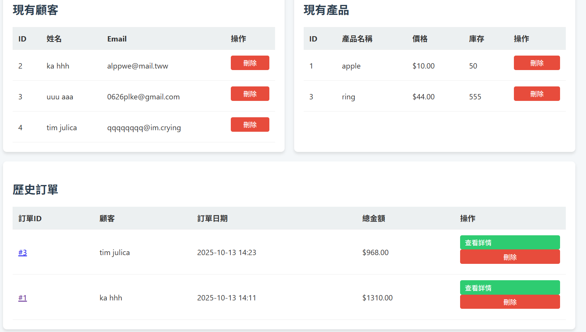

# 114-1 Database
## 作業區  
## 作業一連結 在網頁進行資料匯入並即時更新:[作業一py](https://github.com/kurakanja/114-1-Database/blob/main/W2/W2%20add%20and%20delete.py) [作業一sql](W2/W2.sql) [作業一影片](https://youtu.be/AZ_QymudzOQ)
  
在網頁中進行資料上傳、修改與刪除並即時顯示於網頁上，在mySQL後台刷新也可看到
網頁顯示  
  
## 作業二連結 簡易購物系統:[作業二資料夾](https://github.com/kurakanja/114-1-Database/tree/main/HW2) [作業二影片](https://youtu.be/S1h57MTxhMg)  
網頁顯示  
  
 
## 作業三連結 簡易購物系統:[作業三資料夾](https://github.com/kurakanja/114-1-Database/tree/main/HW3) [作業三影片](https://youtu.be/9RBO2v2-Y5k) [作業三onblender](https://one14-1-database-piv1.onrender.com/)  
1.使用者帳號系統  
#可以註冊新帳號、登入、登出。  
#密碼有加密儲存，確保安全性。  
2.聯絡事項管理  
#使用者可以新增、刪除自己的資料。  
#資料包含：日期、標題、內容、重要性。  
#主頁會按照日期和重要性分組顯示資料，方便管理。  
3.資料隱私  
#每個使用者只能看到自己新增的資料。  
網頁顯示
| 登入畫面 | 新增一項 | 總事項 |
|-------|-------|-------|
|    |    |    |
